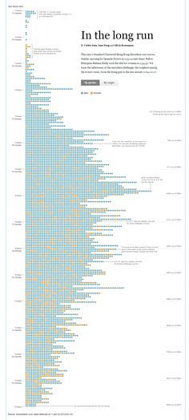
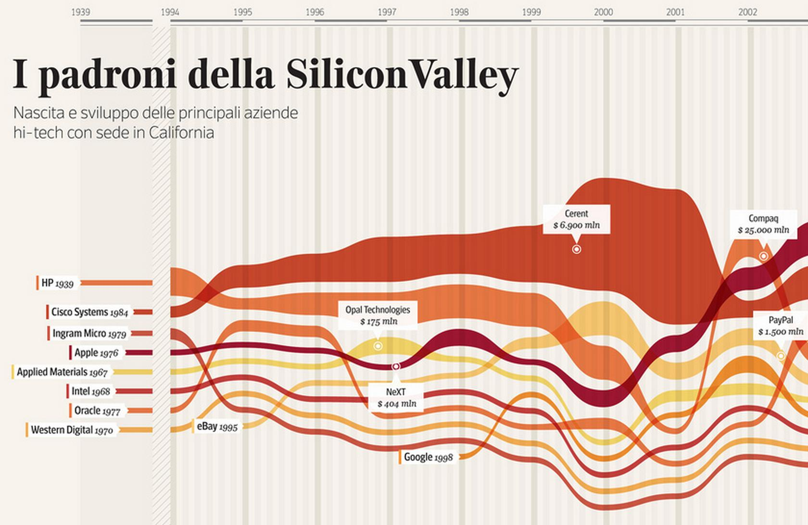
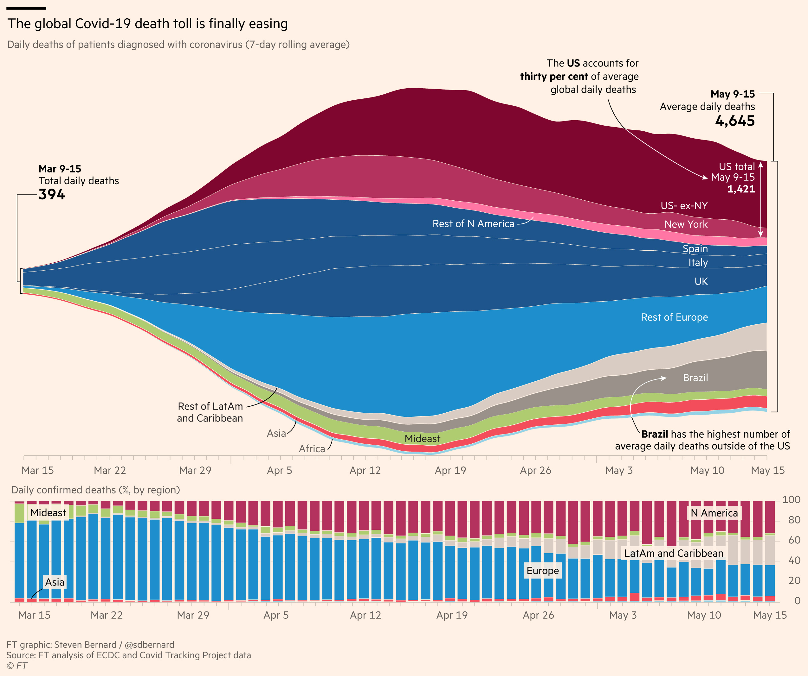

# timeline-covid

Este é o repositório do artigo [Como se desenvolveu a ação do governo federal ao longo do tempo, em razão da pandemia de Covid-19?](https://tchiluanda.github.io/timeline-covid/), desenvolvido pelo grupo de Análise de Dados e Comunicação do Tesouro Nacional.

A preparação dos dados, a análise exploratória e os protótipos das visualizações foram feitos com `R`. A página e as visualizações foram desenvolvidas com HTML, CSS e Javascript puros, e com `d3.js`. Todos os códigos e dados estão disponíveis aqui neste repositório.

## A estrutura do código

## Inspirações

https://questionsindataviz.com/2018/01/27/what-alternative-ways-are-there-for-visualising-timelines/

### Cores

["Andorinhas", de Debora Marques](https://www.instagram.com/p/CHqtTEdMkkK/)

## to-do?

* atrelar crescimento da linha do background ao scroll?
* [ok] incluir "eixo" para valores
* [ok] tooltip para os instrumentos
* mostrar valores autorizados também?
